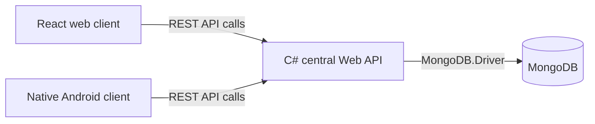

# Smart Solar Microgrid - Developer Setup Guide

This guide covers cloning the project, local development, IIS/LAN deployment, and Android configuration. It is the single source of truth for project setup.

## System workflow



The web and Android applications are UI clients. They do not connect directly to MongoDB; business rules, authorization, and persistent system data are handled by the central API.

## Prerequisites

Install:

- Git
- Visual Studio with ASP.NET and web development support
- .NET SDK `10.0.400` or a compatible later patch
- MongoDB Community Server
- Node.js and npm
- Android Studio

For IIS/LAN deployment, also install IIS, the .NET 10 ASP.NET Core Hosting Bundle, and IIS URL Rewrite.

## Clone the project

```powershell
git clone <repository-url>
Set-Location <repository-folder>
```

Do not commit secrets, local IP addresses, database credentials, `.env.local`, local `.pubxml` profiles, or local application-settings files.

# Local development

Use this workflow while developing and testing on one laptop.

## Configure MongoDB and API settings

MongoDB must be running and reachable by the API. The default connection is:

```text
mongodb://127.0.0.1:27017
```

Each developer can use their own MongoDB host, port, database name, and credentials.

1. Open `backend\SmartSolarMicrogrid.Api`.
2. Copy `appsettings.Development.json.example` to `appsettings.Development.json`.
3. Set the following values in the copied file:
   - `MongoDB:ConnectionString`
   - `MongoDB:DatabaseName`
   - `Jwt:Secret` - a private value of at least 32 characters
   - `SeedBackoffice:Password` - the initial Backoffice password

`appsettings.Development.json` is local and Git-ignored. The seed Backoffice account is created only when its username does not already exist in the configured database; changing the seed password later does not reset an existing account.

## Run the API from Visual Studio

1. Open `backend\SmartSolarMicrogrid.Api\SmartSolarMicrogrid.Api.slnx`.
2. Select the `http` launch profile.
3. Press `F5` to debug, or `Ctrl + F5` to run without debugging.

The local API runs at `http://localhost:5080`.

Verify API availability:

```text
http://localhost:5080/health
```

Expected response:

```json
{"status":"ok","service":"SmartSolarMicrogrid.Api"}
```

Verify MongoDB connectivity:

```text
http://localhost:5080/health/ready
```

Expected response:

```json
{"status":"ready","database":"reachable"}
```

## Run the React web application

From the repository root:

```powershell
Set-Location web
npm ci
Copy-Item .env.example .env.local
```

Add this line to `web\.env.local`:

```text
VITE_API_BASE_URL=http://localhost:5080
```

Start the development server:

```powershell
npm run dev
```

Open the URL printed by Vite, normally `http://localhost:5173/login`. Sign in with the seed Backoffice credentials.

## Run the Android app locally

1. Open the repository's `android` folder in Android Studio.
2. Wait for Gradle sync to finish.
3. Start an Android Emulator and click the green **Run** button.
4. On the Login screen, open **Server Settings**.
5. Enter `http://10.0.2.2:5080`.
6. Select **Test and save address**, return to Login, and sign in.

`10.0.2.2` is the Android Emulator alias for the host laptop. Do not use `localhost` inside the emulator.

# IIS and LAN deployment

Use this workflow for a demonstration with other laptops or physical phones on the same LAN/hotspot.

## Prepare the IIS host laptop

Ensure MongoDB is running, IIS and IIS URL Rewrite are installed, the .NET 10 ASP.NET Core Hosting Bundle is installed, and the active Windows network is set to **Private**.

Create a local API deployment folder, for example:

```powershell
mkdir C:\Deploy\SmartSolarFinal\api
```

Each hosting developer chooses their own deployment folder. Do not commit this path.

## Configure and publish the API

1. In `backend\SmartSolarMicrogrid.Api`, copy `appsettings.Production.json.example` to `appsettings.Production.json`.
2. Set MongoDB connection details, a unique private JWT secret, and a strong seed Backoffice password.
3. In Visual Studio, right-click **SmartSolarMicrogrid.Api** and select **Publish**.
4. Select **New profile**, then **Folder**.
5. Set the target location to:

   ```text
   C:\Deploy\SmartSolarFinal\api
   ```

6. Confirm these settings:
   - Configuration: `Release`
   - Target runtime: `Portable`
   - Delete existing files: `false`
7. Select **Publish**.

Confirm the target folder contains `SmartSolarMicrogrid.Api.dll`, `SmartSolarMicrogrid.Api.exe`, `web.config`, `appsettings.json`, and `appsettings.Production.json`.

Visual Studio creates a local `FolderProfile.pubxml` (or similar) for the machine-specific publish target. It is Git-ignored and must not be committed.

## Create the IIS API site

Open IIS Manager with `Win + R`, then `inetmgr`.

Create an application pool:

```text
Name: SmartSolarMicrogrid.Api
.NET CLR version: No Managed Code
Managed pipeline mode: Integrated
```

Create a website:

```text
Site name: SmartSolarMicrogrid.Api
Physical path: C:\Deploy\SmartSolarFinal\api
Application pool: SmartSolarMicrogrid.Api
Binding type: HTTP
IP address: All Unassigned
Port: 5000
Host name: blank
```

Grant the IIS application-pool identity read/execute access to the deployment folder. Then verify:

```text
http://localhost:5000/health
http://localhost:5000/health/ready
```

## Allow API LAN access

Run PowerShell as Administrator:

```powershell
New-NetFirewallRule -DisplayName "SmartSolarMicrogrid-Api-LAN" -Direction Inbound -Protocol TCP -LocalPort 5000 -Action Allow -Profile Private -RemoteAddress LocalSubnet
```

Find the host laptop's IPv4 address with `ipconfig`. From another device, verify `http://<server-IP>:5000/health`.

## Build and host the React UI in IIS

Before building for IIS, remove or comment out this local-development override in `web\.env.local`:

```text
# VITE_API_BASE_URL=http://localhost:5080
```

Otherwise LAN browsers will try to call their own `localhost:5080`.

Build the UI:

```powershell
Set-Location <repository-folder>\web
npm ci
npm run build
```

The output directory is `<repository-folder>\web\dist`.

In IIS Manager, create a separate website:

```text
Site name: SmartSolarMicrogrid.Web
Physical path: <repository-folder>\web\dist
Binding type: HTTP
IP address: All Unassigned
Port: 8080
Host name: blank
```

The built UI includes its React route-rewrite `web.config`; IIS URL Rewrite is required for paths such as `/login`.

Allow LAN access by running PowerShell as Administrator:

```powershell
New-NetFirewallRule -DisplayName "SmartSolarMicrogrid-Web-LAN" -Direction Inbound -Protocol TCP -LocalPort 8080 -Action Allow -Profile Private -RemoteAddress LocalSubnet
```

Verify on the host at `http://localhost:8080/login`, then from another device at `http://<server-IP>:8080/login`.

## Configure Android for IIS/LAN

For a physical phone or for an emulator during the IIS demonstration, open **Server Settings** and use:

```text
http://<server-IP>:5000
```

Do not use `http://10.0.2.2:5080` for IIS/LAN deployment; it is only for local Android Emulator development with the Visual Studio API profile.

## URL reference

| Situation | API URL | Web URL | Android API URL |
| --- | --- | --- | --- |
| Local Visual Studio development | `http://localhost:5080` | `http://localhost:5173` | `http://10.0.2.2:5080` |
| IIS host laptop | `http://localhost:5000` | `http://localhost:8080/login` | `http://localhost:5000` |
| Another LAN laptop or physical phone | `http://<server-IP>:5000` | `http://<server-IP>:8080/login` | `http://<server-IP>:5000` |

## Files that must stay local

Do not commit:

```text
appsettings.Development.json
appsettings.Production.json
.env.local
backend\SmartSolarMicrogrid.Api\Properties\PublishProfiles\*.pubxml
MongoDB credentials
JWT secrets
seed passwords
LAN IP addresses
personal deployment paths
```
