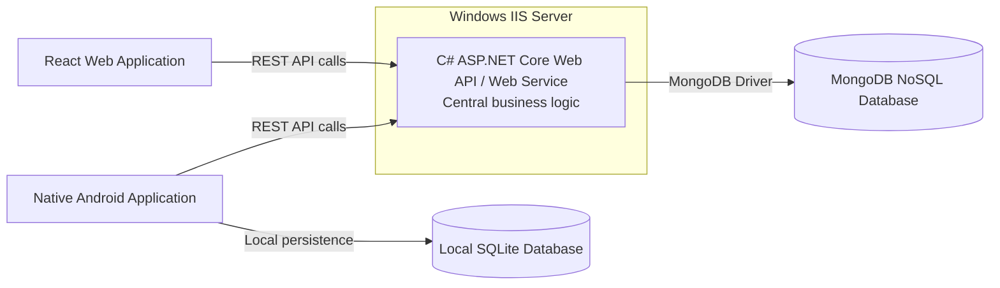

# Smart Solar Microgrid Trading System

The Smart Solar Microgrid Trading System is a client-server application for managing solar microgrid nodes, Prosumers, energy reservations, booking slots, and energy-transfer operations. It includes a React web application, a native Android application, and a central C# Web API connected to MongoDB.

##Group ID: 
40

## Git repository

[Smart Solar Microgrid Trading System](https://github.com/Smart-Solar-Microgrid-Trading-System/SmartSolarFinal)

## Individual contributions

The project was completed collaboratively by four members. Each member's primary responsibilities are listed below.

| Student ID | Student name | Individual contribution |
| --- | --- | --- |
| IT23205956 | Thilakaratne A.A.S.M. | Developed microgrid node management, including node registration, editing, deactivation, capacity and battery-slot information, map-based node views, and QR verification features. |
| IT23151642 | K.H. Ruwanmali | Developed booking-slot management, reservation monitoring, approval and rejection operations, dashboard summaries, and the related web and mobile interfaces. |
| IT23297968 | Hirimuthugodage J. | Developed user and Prosumer management with role-based authentication, including registration, profile updates, account status management, reactivation, login, session security, password changes, and account search. |
| IT23289420 | Rathnayake R.M.S.B. | Developed energy reservation management, including creating, modifying, cancelling, searching, and viewing reservations, together with scheduling rules and reservation tests. |

## Application demonstration

A video of no more than five minutes demonstrating the application will be available through YouTube or OneDrive.

**Video link:** 
https://mysliit-my.sharepoint.com/personal/it23151642_my_sliit_lk/_layouts/15/stream.aspx?id=%2Fpersonal%2Fit23151642%5Fmy%5Fsliit%5Flk%2FDocuments%2FEAD%20Assignement%2Fead%5Fvideo%2Emp4&referrer=StreamWebApp%2EWeb&referrerScenario=AddressBarCopied%2Eview%2E8b9caf42%2D720b%2D45c3%2D822e%2D4ebd61127cde

## System architecture


```mermaid
flowchart LR
    Web[React Web Application]
    Android[Native Android Application]
    SQLite[(Local SQLite Database)]

    subgraph IIS[Windows IIS Server]
        Api[C# ASP.NET Core Web API / Web Service<br/>Central business logic]
    end

    MongoDB[(MongoDB NoSQL Database)]

    Web -->|REST API calls| Api
    Android -->|REST API calls| Api
    Android -->|Local persistence| SQLite
    Api -->|MongoDB Driver| MongoDB
```

The web and Android applications operate as user interfaces. Authentication, authorization, validation, and business rules are handled by the central API. The clients do not connect directly to MongoDB.

## Main functionality

### Web application

- Backoffice and Grid Operator authentication and role-based access
- Web-user and Prosumer account management
- Microgrid node and battery-slot management
- Energy reservation creation, monitoring, updating, and cancellation
- Operational and reservation dashboards

### Android application

- Prosumer registration, profile updates, and account-deactivation requests
- Prosumer and Grid Operator authentication
- Reservation creation, modification, cancellation, search, and history
- Pending and approved booking information
- Nearby microgrid-node map and details
- Transaction QR-code display, scanning, and verification workflows
- SQLite persistence for local session and profile information

### Central web service

- RESTful C# ASP.NET Core Web API
- Centralized business rules and validation
- JWT authentication and role-based authorization
- MongoDB server-side persistence
- Windows IIS deployment support

## Technology stack

| Component | Technology |
| --- | --- |
| Web application | React and Tailwind CSS |
| Mobile application | Native Android using Kotlin and XML layouts |
| Local mobile storage | SQLite |
| Web service | C# ASP.NET Core Web API |
| Server database | MongoDB |
| Hosting | Windows IIS Server |
| Communication | RESTful API over HTTP or HTTPS |

## Quick start

### Prerequisites

- .NET SDK 10
- MongoDB Community Server
- Node.js and npm
- Android Studio

### Run the API

Copy `backend/SmartSolarMicrogrid.Api/appsettings.Development.json.example` to `appsettings.Development.json` and configure MongoDB, JWT, and seed Backoffice values. Do not commit this local configuration file.

```powershell
dotnet run --project backend/SmartSolarMicrogrid.Api/SmartSolarMicrogrid.Api.csproj
```

The default development address is `http://localhost:5080`. Verify it at `http://localhost:5080/health`.

### Run the web application

```powershell
Set-Location web
npm ci
Copy-Item .env.example .env.local
npm run dev
```

Set `VITE_API_BASE_URL=http://localhost:5080` in `web/.env.local`. The development site normally opens at `http://localhost:5173`.

### Run the Android application

1. Open the `android` directory in Android Studio.
2. Allow Gradle synchronization to finish.
3. Run the app on an emulator or physical Android device.
4. Open **Server Settings** on the login screen and configure the API address.

Use `http://10.0.2.2:5080` from the Android emulator. For a physical device, use the API computer's LAN address and ensure both devices are connected to the same network.
